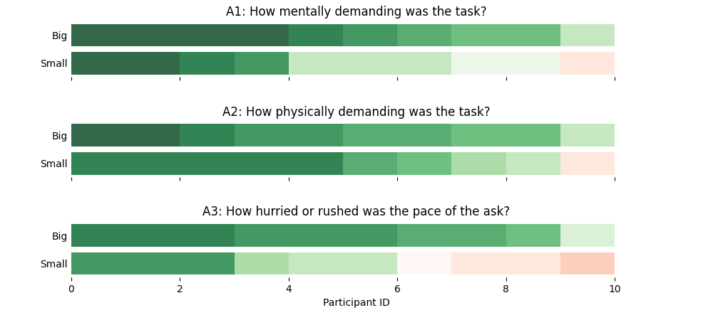
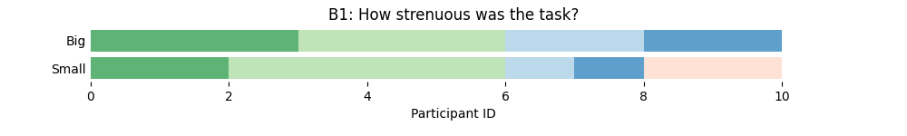
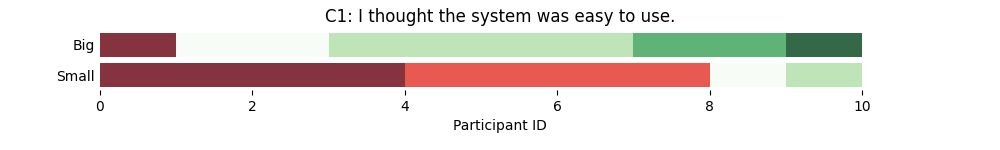

# Problem Setup

Let's assume we performed a within-subject study with two conditions _Big_ and _Small_, asking the same questions A1, A2, A3, B1, and C1, where A1 to A3 are measured by a TLX scale, B1 is measured by a Borg Scale, and C1 is measured by 7-point Likert scale.

Let's assume, we collect the data in a table such as:

```csv
Condition;QuestionId;QuestionText;Scale;P1;P2;P3;P4;P5;P6;P7;P8;P9;P10
Big;A1;How mentally demanding was the task?;tlx;2;4;1;3;1;5;1;8;1;5
Big;A2;How physically demanding was the task?;tlx;4;5;3;1;4;2;5;3;8;1
Big;A3;How hurried or rushed was the pace of the ask?;tlx;2;3;4;2;3;9;4;3;5;2
Big;B1;How strenuous was the task?;borg;3;3;1;0;2;0;1;0;2;1
Big;C1;I thought the system was easy to use.;likert;6;7;5;4;4;5;5;1;5;6
Small;A1;How mentally demanding was the task?;tlx;3;8;10;8;10;1;8;1;12;2
Small;A2;How physically demanding was the task?;tlx;2;7;4;8;5;2;2;2;12;2
Small;A3;How hurried or rushed was the pace of the ask?;tlx;3;8;11;8;13;12;7;3;12;3
Small;B1;How strenuous was the task?;borg;1;4;1;3;4;2;1;0;1;0
Small;C1;I thought the system was easy to use.;likert;5;1;2;2;2;2;1;1;1;4
```

# Visualzation

How can we make a fancy paper figure from this data?


```sh
python viz.py viz questionnaire.csv 
```

will create the figures and legends per scale (in this case, TLX, Borg CR10, and 7-point Likert System Usability Scale) in the "figures" subfolder:

**TLX**



**Borg**



**Likert**



# Pairwise Wilcoxon Tests

```sh
python viz.py viz questionnaire.csv 
```

```txt
A3
            Big     Small
Big    1.000000  0.007526
Small  0.007526  1.000000
C1
            Big     Small
Big    1.000000  0.007369
Small  0.007369  1.000000
```